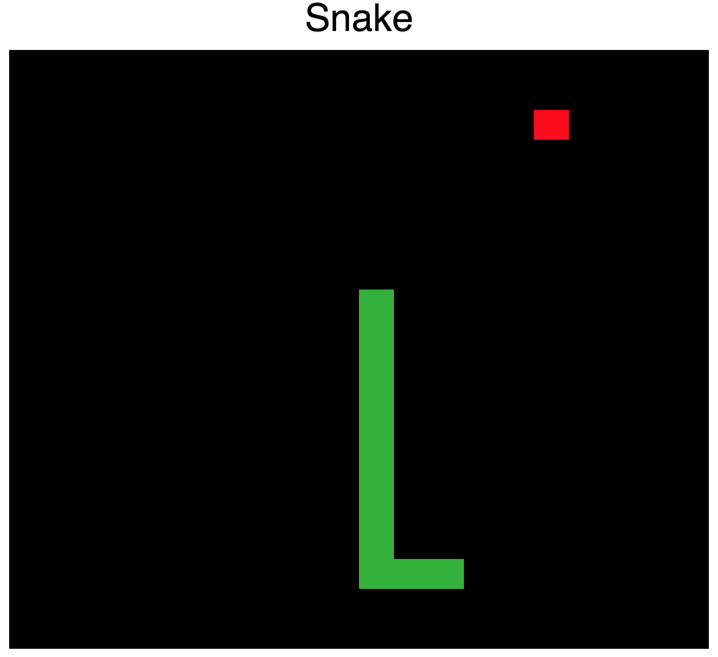

## Snake
### Written by: Akshat Vasudev  

This is a classic game of Snake made in ReactJS.  I used the create-react-app scaffolding tool as a starting point.

Follow these steps to get this app running on your local:  


```
npm install  
yarn start
```

Some things I would've liked to update, time permitting, would be:  
1. When the snake hits the wall, it moves by 1 more before the collusion happens, instead of stopping there.  
2. Add logic to make sure the food item doesn't get added anywhere on the snake's body

